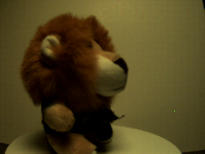
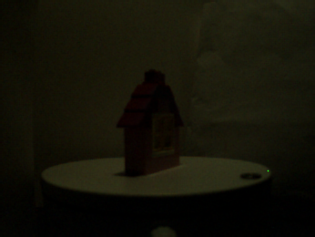
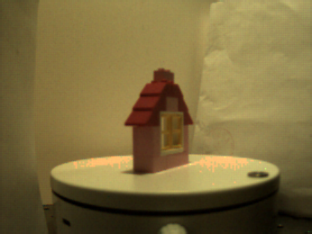

# Dark-EvGS

> 本仓库用于复现作者发表于 **IEEE Transactions on Image Processing (TIP, 2026)** 的工作（作者口径）。当前仓库提供了代码、示例数据与部分已训练模型结果，重点支持**渲染复现与数据使用**。

---

## 📌 论文信息

- **论文主题**：低照度事件相机 + 高斯表示（Gaussian Splatting）相关重建/增强（对应本仓库 `Dark-EvGS`）。
- **期刊信息**：IEEE Transactions on Image Processing (TIP), 2026（根据作者说明）。
- **论文链接**：目前可用提交页面为（需要 arXiv 登录权限）：
  - https://arxiv.org/submit/7472197/view

> 建议后续补充公开可访问链接（如 arXiv 公开号、IEEE Xplore DOI），便于读者直接引用。

---

## ✨ 仓库提供内容

本仓库目前以**可复现实验资产**为主，包含：

1. **渲染代码**：使用已有 3D Gaussian 模型输出渲染结果（`render.py`）。
2. **数据转换脚本**：COLMAP 预处理脚本（`convert.py`）。
3. **环境配置**：Conda 环境（`environment.yml`）。
4. **示例场景数据**（`data/`）：
   - 低照度图像序列（`low_light_frames/`）
   - 明亮条件真值图像（`gt_bright_frames/`）
   - 事件流（`event.npz`，通常包含 `x/y/t/p`）
   - 部分场景带 COLMAP 稀疏重建（`sparse/0`）
   - 部分场景带已训练模型（`output/point_cloud/...`）

---

## 🗂️ 数据集概览（当前仓库）

| Scene | Low-light frames | Bright GT frames | `event.npz` | `sparse/0` | `output/point_cloud` |
|---|---:|---:|:---:|:---:|:---:|
| badminton_down | 100 | 100 | ✅ | ✅ | ❌ |
| baseball | 101 | 101 | ✅ | ✅ | ✅ |
| cat | 222 | 268 | ✅ | ❌ | ❌ |
| house | 100 | 100 | ✅ | ✅ | ✅ |
| lion | 180 | 180 | ✅ | ✅ | ✅ |
| panda | 120 | 120 | ✅ | ❌ | ✅ |

> 说明：不同场景上传内容可能不完全一致（例如部分场景缺 `sparse/0` 或 `output/point_cloud`），属于正常情况。

---

## 🚀 快速开始

### 1) 环境安装

```bash
conda env create -f environment.yml
conda activate gaussian_splatting
```

### 2) 使用已有 checkpoint 进行渲染复现

以 `lion` 场景为例：

```bash
python render.py -m data/lion/output
```

渲染结果默认保存到：

- `data/lion/output/train/ours_<iter>/renders`
- `data/lion/output/test/ours_<iter>/renders`

可选参数：

- `--iteration <int>`：指定加载迭代（默认 `-1` 表示最新）
- `--skip_train`：仅渲染测试集
- `--skip_test`：仅渲染训练集

示例（只渲染 test）：

```bash
python render.py -m data/lion/output --skip_train
```

---

## 🧪 数据读取说明

### 图像序列

- 低照度输入：`data/<scene>/low_light_frames/*.png`
- 明亮 GT：`data/<scene>/gt_bright_frames/*.png`

### 事件流（`event.npz`）

通常包含以下键：

- `x`：像素横坐标
- `y`：像素纵坐标
- `t`：时间戳
- `p`：极性（正/负事件）

示例读取：

```python
import numpy as np

events = np.load("data/lion/event.npz")
x, y, t, p = events["x"], events["y"], events["t"], events["p"]
print(x.shape, y.shape, t.shape, p.shape)
```

---

## 🛠️ 从自有数据构建 COLMAP 输入（可选）

如果你希望将自己的多视角图像整理成该仓库可用格式，可使用：

```bash
python convert.py -s <your_scene_path>
```

其中 `<your_scene_path>` 目录下建议包含 `input/` 图像目录。脚本会调用 COLMAP 进行特征提取、匹配、稀疏重建与去畸变，并整理到 `sparse/0`。

---

## 🖼️ 可视化示例（仓库内样例）

### Lion 场景（低照度 vs 明亮 GT）

| Low-light | Bright GT |
|---|---|
|  |  |
|  |  |

### House 场景（低照度 vs 明亮 GT）

| Low-light | Bright GT |
|---|---|
|  |  |

---

## 📁 推荐目录组织（单场景）

```text
data/<scene>/
├── low_light_frames/
├── gt_bright_frames/
├── event.npz
├── timestamp.txt (or timestamps.txt)
├── sparse/0/                 # optional
└── output/                   # optional
    ├── cfg_args
    ├── exposure.json
    ├── cameras.json
    └── point_cloud/
```

---

## 📬 引用与致谢

如果你在研究中使用了本仓库，请在你的论文中引用对应 TIP 文章（待补充正式 BibTeX / DOI / arXiv 公开号）。

同时，本仓库代码结构继承/参考了 3D Gaussian Splatting 社区实现；如用于学术研究，也请同时引用相关基础工作。

---

## ❓你可以补充给我的信息（我可继续帮你完善）

如果你愿意，我可以下一步直接把 README 升级成“投稿级别”版本（含中英双语摘要、BibTeX、FAQ、复现实验表格、常见报错），你只需补充：

1. 论文**正式标题**（中/英文）
2. 作者列表与单位
3. 公开论文链接（arXiv ID 或 IEEE Xplore DOI）
4. 是否需要加入 benchmark 数值（PSNR/SSIM/LPIPS 等）
5. 许可证与数据使用声明（如仅科研用途）
